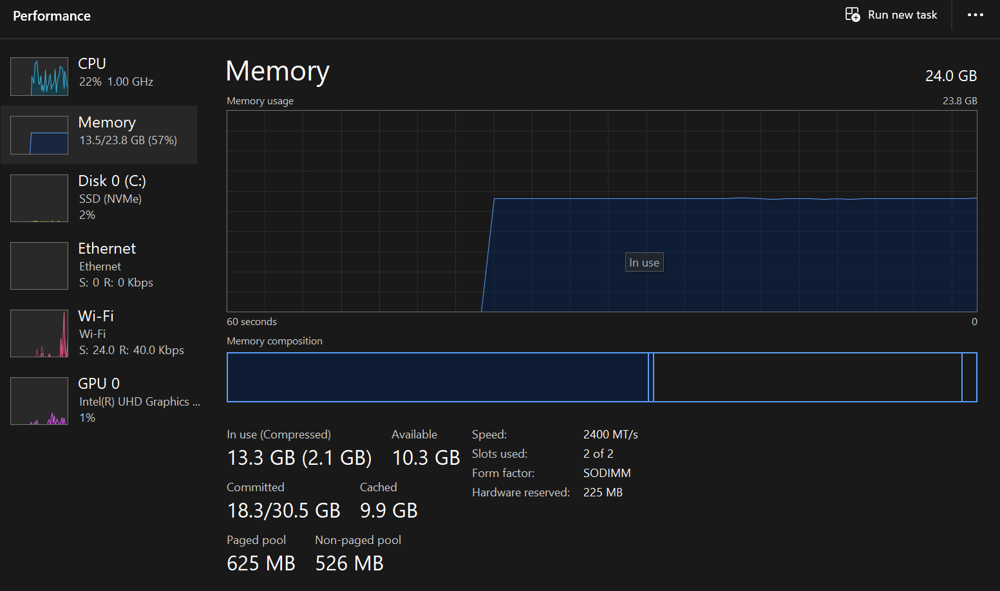
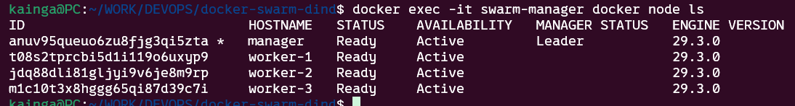

# Docker Swarm-in-Docker (DinD) Development Lab

## Table of Contents

- [Overview](#overview)
- [Advantages](#advantages)
  - [Resource Consumption](#1-resource-consumption)
  - [Operational Health](#2-operational-health)
- [Technical Implementation](#technical-implementation)
  - [Nested Containerization](#1-nested-containerization-dind)
  - [Filesystem and Process Isolation](#2-filesystem-and-process-isolation)
  - [Networking and Service Discovery](#3-networking-and-service-discovery)
- [Getting Started](#getting-started)
  - [Prerequisites](#prerequisites)
  - [Deployment Steps](#deployment-steps)
  - [Accessing the Cluster](#accessing-the-cluster)
- [Management Commands](#management-commands)

---

## Overview

This project provides a fully functional, 4-node Docker Swarm cluster running entirely within Docker containers. By utilizing Docker-in-Docker (DinD) technology, this environment simulates a production-grade orchestration layer without the overhead of traditional Virtual Machines.

---

## Advantages

The primary benefit of this architecture is extreme resource efficiency. By leveraging **Copy-on-Write (CoW)** at the storage layer and sharing the host's Linux kernel, we can run a full orchestration environment on standard hardware.

### 1. Resource Consumption

As shown in the performance monitor below, running 4 independent nodes (Manager + 3 Workers) alongside the host OS results in minimal CPU and RAM overhead. Unlike VirtualBox or VMware, which reserve fixed chunks of memory, DinD only consumes what the processes actually use.

### 2. Operational Health

The Swarm Manager successfully orchestrates all nodes as independent entities. Each node runs its own internal Docker Engine, allowing for true multi-node service testing.

| Feature            | DinD Lab (Current)            | Oracle VirtualBox (Previous) |
| :----------------- | :---------------------------- | :--------------------------- |
| **RAM Usage**      | ~300MB for 4 nodes            | ~4GB for 4 nodes             |
| **Disk Footprint** | Shared image layers (Minimal) | Multiple 10GB+ Virtual Disks |
| **Boot Speed**     | Under 10 seconds              | 2 to 5 minutes               |
| **Automation**     | Lean Makefile and Compose     | Manual VM configuration      |

---

## Technical Implementation

The architecture is built on three core pillars of Linux containerization:

### 1. Nested Containerization (DinD)

We use the `docker:dind` image as the base for our nodes. Each node runs its own isolated Docker daemon (`dockerd`). The host machine acts as the "physical" infrastructure, while the containers act as independent "servers."

### 2. Filesystem and Process Isolation

- **Namespaces:** The Linux Kernel is used to "partition" the process view, network, and mount points. Each node believes it has its own root filesystem.
- **Privileged Mode:** Nodes are run with the `--privileged` flag, granting the inner Docker engines the necessary kernel capabilities (like `CAP_SYS_ADMIN`) to manage their own child containers and iptables.
- **Persistence:** Named volumes are mapped to `/var/lib/docker` on each node. This ensures that the Swarm state, image cache, and joined-node identity survive a `docker-compose down` command.

### 3. Networking and Service Discovery

- **Bridge Network:** All nodes sit on a custom Docker bridge network called `swarm-net`.
- **DNS Resolution:** Nodes join the cluster using the service name `manager` rather than volatile IP addresses.
- **Routing Mesh:** The cluster utilizes the Ingress Routing Mesh, allowing any service published on a port to be reachable via the Manager's exposed ports on the host machine.

---

## Getting Started

### Prerequisites

- Docker and Docker Compose installed on the host machine.
- `make` utility installed for automation.

### Deployment Steps

1. **Start Infrastructure:**
   Run `docker-compose up -d` to pull the images and start the 4 containers.
2. **Initialize Cluster:**
   Run `docker exec -it swarm-manager docker swarm init` to promote the manager to a Swarm Leader.
3. **Join Workers:**
   Run `make join`. This command uses the Makefile to dynamically fetch the join token from the manager and register the 3 workers.
4. **Monitor the Swarm:**
   Run `make visualizer` to deploy the visualizer service inside the cluster.

### Accessing the Cluster

- **Visualizer:** Access `http://localhost:8080` to see the node distribution.
- **Web Services:** Any service published on port 80 will be accessible via `http://localhost:80`.

---

## Management Commands

- `docker exec -it swarm-manager docker node ls`: View the current state and health of all cluster nodes.
- `docker-compose down`: Stop the cluster while preserving all data.
- `docker-compose down -v`: Completely wipe the cluster and all persistent volumes.
